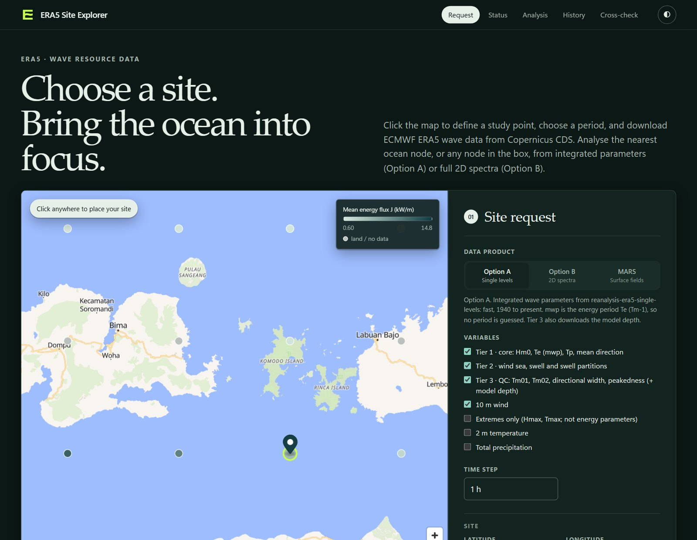
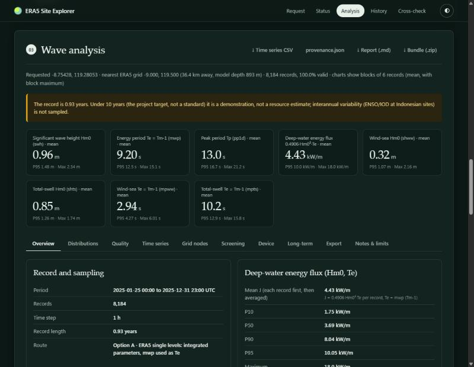
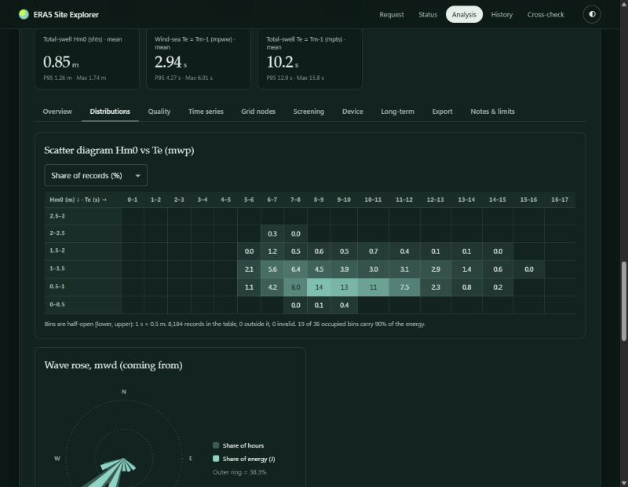
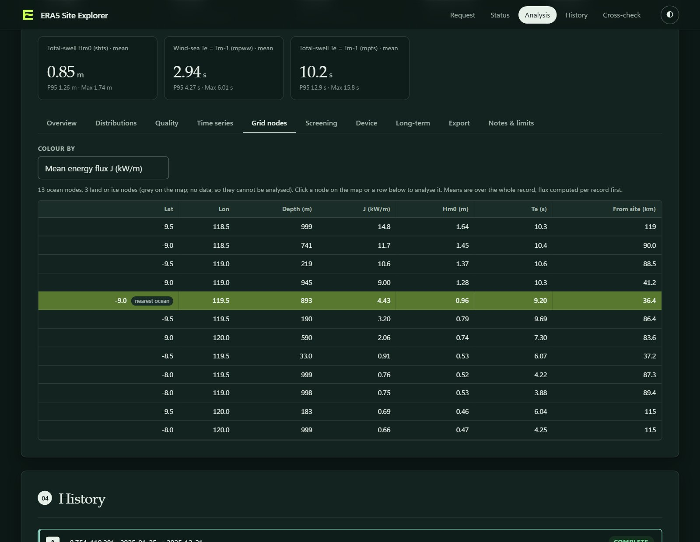

# ERA5 Site Explorer

A local web app for wave-energy resource work. Pick a site on a map, download ERA5 wave data from
Copernicus CDS, and analyse it at any grid node of the download: energy flux, climatology, scatter tables,
wave roses, spectral partitioning, site screening, device performance, extreme values and a report export.

Two data routes are kept strictly separate. **Option A** uses ERA5 single-level integrated parameters
(`swh`, `mwp`, `pp1d`, ...). **Option B** uses the 2D wave spectra and derives every parameter from E(f, θ).
A cross-check panel compares them but never merges them. The basemap is OpenFreeMap (OpenStreetMap data)
and needs no account or token.

> **Status.** The numerics are tested on synthetic data with known answers (193 tests, `python -m pytest -q`).
> Option A has completed real CDS downloads (2025 single levels, under one year; the screenshots below come
> from one). Option B has no completed job: five were refused by CDS as too large, one was cancelled, and
> one 6-hourly July 2026 job downloaded its 16 files but was marked failed by an app restart. Option A and
> Option B have not been compared on real data, and no multi-year record has been analysed.
> [docs/verification.md](docs/verification.md) lists what was verified and what is still open. Treat results
> as a screening aid, not a resource assessment.

## Screenshots

All four are from one Option A demonstration job: ERA5 single levels, hourly, 2025 (0.93 years, 8,184 records),
near −8.75°, 119.28° (Komodo–Flores area). The record is far shorter than the 10 years the app itself asks for, and the
nearest ocean node is 36.4 km from the site, so the numbers illustrate the interface and are not a resource
estimate.

| | |
|---|---|
|  |  |
| **Site request.** Click the map, choose the data route, variables, time step and period. Grid nodes are drawn after a download, coloured by mean flux. | **Analysis.** Key numbers, the short-record warning and deep-water flux statistics (flux computed per record, then averaged). |
|  |  |
| **Distributions.** Hm0–Te scatter with the share of records per bin, and the wave rose by hours and by energy. | **Grid nodes.** Every ERA5 node in the box with depth, mean flux, Hm0 and Te. Neighbouring nodes here differ a lot, so the choice of node matters. |

## Setup

1. Configure CDS credentials in `~/.cdsapirc` and accept the ERA5 licence on the CDS website.
   Credentials never go in this repository.
2. Install and run:

```bash
git clone https://github.com/EinggrauMFW/ERA5-Site-Explorer.git
cd ERA5-Site-Explorer
python -m venv .venv
.venv/bin/pip install -r requirements.txt     # Windows: .venv\Scripts\pip
.venv/bin/python app.py                       # Windows: .venv\Scripts\python
```

Open <http://127.0.0.1:5000>, then click or drag the marker to select a site. **Preview request only**
prints the exact CDS requests, the grid area and an uncompressed size estimate, and writes
`provenance.json`, without contacting CDS.

Optional environment variables (see `.env.example`; they are not loaded automatically): `PORT`,
`MAX_JOBS` (concurrent downloads, default 2), `DOWNLOADS_DIR`.

`wavespectra` is optional (`pip install wavespectra`). Without it, spectral partitioning and one
cross-check test report as unavailable; everything else works.

Developed and tested on Python 3.13 and Windows 11; other versions were not tried.

## Download products

| Product | CDS dataset | What you get |
|---|---|---|
| **Option A · single levels** (default) | `reanalysis-era5-single-levels` | Tier 1: Hm0 (`swh`), Te (`mwp`), Tp (`pp1d`), mean direction (`mwd`). Tier 2: wind-sea and total-swell height, period and direction, three swell partitions. Tier 3: Tm01 (`mp1`), Tm02 (`mp2`), directional width, peakedness, plus model depth. Optional groups: 10 m wind, Hmax/Tmax (extremes only), 2 m temperature, precipitation. |
| **Option B · 2D wave spectra** | `reanalysis-era5-complete`, stream `wave`, param `251.140` | 24 directions × 30 frequencies on the 0.5° grid, plus model depth. Buffer ≤ 2° and ≤ 2 years per request. |
| **ERA5 MARS · surface fields** | `reanalysis-era5-complete`, stream `oper` | Analysis fields by GRIB code (2 m temperature, 10 m wind, pressure, SST). |

The time step (1, 3, 6, 12 or 24 h) is selectable. The MARS products choose `expver` automatically (`1`
for months older than about 100 days, `5` for newer; override with the **ERA5 version** selector or
`--expver`). The fetcher checks every single-levels variable name against the live CDS catalogue and
stops requesting any it does not accept.

Each request lives in `downloads/<job-id>/`: one NetCDF per month, `era5_bathymetry.nc` (model depth, one
small request) and `provenance.json` (exact requests, dataset metadata and DOI, expver, grid, period, file
hashes, software versions, attribution; no credentials). ERA5 starts on 1940-01-01 and runs to about six
days ago; a request may span at most five years (two for spectra), and each month is a separate CDS
request. The box is clipped at ±180° longitude, not wrapped.

The fetcher also runs on its own; `python fetch_era5_waves.py --help` lists the options (`--product`,
`--groups`, `--time-step`, `--expver`, `--dry-run`, `--probe`, `--estimate`).

### CDS cost limit

CDS refuses MARS requests above a cost limit ("cost limits exceeded"). A probe on 2026-10-01 showed that
one day of 6-hourly spectra is accepted (either `expver`, old or recent dates) while one day of hourly
spectra is refused. So the number of time steps matters by itself, not only the field count: a 6-hourly
month (86,400 fields) works, a single hourly day (17,280 fields) does not. What CDS counts exactly is not
known, so the fetcher adapts and remembers what CDS accepts for the rest of the run:

1. Spectra months are cut into near-equal runs of days of at most 86,400 fields.
2. A refused request first has its time steps reduced (24 → 12 → 6 → 4; four is the largest count seen
   accepted), then its days halved; the learned shape is applied to every later request. An hourly month
   becomes requests of four time steps each, such as `era5-spectra_2026-07_d01-08_h00-03.nc`, and the
   analysis merges the files by time.
3. It stops at the first one-day request with a small time list that CDS still refuses, and says what to
   change (a larger time step, or the other `expver`).
4. Downloads give up on a persistent CDS server error after 30 retries.

Hourly spectra are slow (about six requests per day). Unless you need them, use a 3 h or 6 h step.

`--probe` submits five one-day test requests, reports which are accepted or refused, and cancels each
accepted one at once, so nothing is downloaded:

```bash
python fetch_era5_waves.py --latitude -8.88 --longitude 114.89 \
    --start 2026-07-01 --end 2026-07-31 --output downloads/test \
    --product wave-spectra --time-step 6 --probe
```

`--estimate` asks CDS for a cost estimate and exits. CDS answers HTTP 500 for that endpoint on MARS
datasets, so it is never called during downloads (an earlier version did, and the library retried the 500
for hours). Use `--probe` instead.

## The interface

A sticky header links to the page sections (Status and Analysis appear once a job is open). The map stays
in view while the form scrolls and, after a download, draws every grid node with a colour legend. The
analysis keeps its key numbers at the top and splits the rest into tabs: Overview, Distributions,
Direction (with the sector form), Quality, Time series, Grid nodes, Notes & limits, and the resource tools
below. History lists past jobs as cards; open one directly with `/#job=<job-id>`. The theme follows the
system and can be switched in the header (the choice is remembered). It is usable on a phone.

## Definitions used everywhere

`m_n = ∫ fⁿ E(f) df`. These quantities differ and are never given the same label:

| Symbol | Definition | ERA5 name |
|---|---|---|
| Hm0 | 4√m0 | `swh` |
| **Te = Tm-1** | m-1/m0, the energy period | `mwp` (ECMWF defines `mwp` as this) |
| Tm01 | m0/m1 | `mp1` |
| Tm02 | √(m0/m2), zero-crossing | `mp2` |
| Tp | 1/fp, parabolic fit at the peak | `pp1d` |

Deep-water flux **J = ρg²/(64π) · Hm0² · Te = 0.4906 · Hm0² · Te kW/m** (ρ = 1025 kg/m³,
g = 9.81 m/s²). J is computed per record and then averaged, never from mean Hm0 and mean Te. Option A
uses `mwp` directly as Te, so no Tp→Te ratio is applied and `pp1d` is deliberately not in the flux.
Directions are coming-from, degrees true clockwise; ERA5 spectra are stored going-to and converted in one
place. The ordering Tm02 ≤ Tm01 ≤ Te must hold for every record and is checked. Energy is reported with
`8766 h` per year.

## Analysis

**Option A** (per record, nearest ocean cell, distance and model depth shown): deep-water flux
statistics, monthly climatology, Hm0–Te scatter (0.5 m × 1 s bins, half-open, hours and energy shares,
out-of-table counts), wave rose by hours and by flux, wind-sea and swell composition (swell-dominated
hours, swell energy share, a `swh² ≈ shww² + shts²` check), the Tm02 ≤ Tm01 ≤ Te check, Te/Tp, steepness,
a deep-water validity check (`depth < L0/2`, L0 = g·Te²/2π), a record-length warning under 10 years (the
project target, not a standard) and an hourly vs 6-hourly sampling check.

**Option B** adds, from the spectrum: Hm0, Te, Tm01, Tm02, ε0, grid and parabolic Tp, the energy-weighted
mean direction, the ECMWF directional width, the **finite-depth energy-flux vector** (group velocity from
the dispersion relation at the model depth; deep water if no depth), flux direction θJ and
directionality, flux by period (cumulative curve) and by 15° direction bin, Hm0–Te and Hm0–Tp scatter
tables, a **fixed-heading sector flux** (enter a heading and half-width: the share of flux inside the
sector, taken from the spectrum, versus filtering hours by mean direction), PTM3 watershed partitioning
(per-system Hm0, Tp, Te, direction, J; share of multi-system hours), and a JONSWAP γ fit and Te/Tp as
diagnostics.

Every analysis writes `timeseries.csv` (the full per-record series, downloadable) beside the data.

### Grid-node picker

A box downloads every ERA5 grid node inside it (6°N–0°N and 95°E–100°E at 0.5° holds 13 × 11 = 143 nodes,
42 of them land). After a download the map draws all nodes coloured by mean flux, Hm0 or Te, with land or
ice nodes (no data) in grey, and a table lists them with depth, mean values and distance from the site.
Click a node or a row to rerun the whole analysis for that node, or **Back to nearest ocean cell** to
return to the default. No new download is needed: the data for every node is already in the files. Means
are over the record with flux computed per record first; for spectra the summary uses at most 300 records
spread over the period and says so. Each node's analysis and time series are cached separately, and the
sector flux, the CSV download and the tools below follow the selected node. If the OpenFreeMap basemap
cannot be reached, the map falls back to a plain background so the nodes still draw.

## Resource tools

Four tools sit on top of the analysis as tabs and header actions. They are plugins (see below), work on
the selected grid node, and run on both routes unless noted.

- **Screening.** Every ocean node at once: colour the map by mean flux, Hm0, Te, 95th-percentile flux,
  flux variability, the max/min calendar-season ratio, or the mean flux of one season or month; a ranking
  table; a month-by-node heat table; and a side-by-side comparison of up to three nodes with the 12-month
  flux climatology. Seasons are calendar seasons by month (DJF = Dec–Feb, ...). Spectra statistics use at
  most 1,500 records per node.
- **Device.** Upload a power matrix CSV (rows Hm0 in m, columns period in s, power in kW; centres or lower
  edges; undefined cells blank) and get annual energy production (`mean power × 8766 h`), capacity
  factor, the share of records and of flux outside the matrix, two capture-width estimators
  (energy-weighted `ΣP/ΣJ`, and the mean of `P/J` over records with `J ≥ 1 kW/m`, each also as a ratio to a
  width you give), monthly energy shares and an occupancy table, using nearest-bin and bilinear lookup.
  When the matrix's period axis is unknown, Te- and Tp-indexed results are both shown and the AEP spread
  is the bound of that ambiguity; they are never blended. The bundled example matrix is synthetic, not a
  real device.
- **Long-term.** Monthly and seasonal climatology with the P10–P90 band across years; COV; a monthly and a
  seasonal variability index `(max − min) / annual mean`; interannual variation of complete years; and
  extreme Hm0 by peaks over threshold: runs declustering, a generalised Pareto fit by maximum
  likelihood, return levels with 90% bootstrap intervals (Poisson event count, resampled excesses), a
  threshold-sensitivity table and a log-axis return-level plot. It refuses to fit with too few peaks and
  warns when a return period exceeds three times the record. A one-month record is a demonstration, not an
  estimate.
- **Export.** `report.md` per route (metadata, key results, every table on the page, definitions and
  limits, provenance with DOIs and file hashes, plus device and long-term fragments), each table as CSV
  with unit-suffixed column names, the rose and scatter diagrams as standalone SVG (light or dark), and a
  zip bundle with all of it, the verbatim `provenance.json`, the node's `timeseries.csv` and a README of the
  bin and direction conventions. The tab lists exactly what exists for the job.

### Adding a tool

A tool is two files: `plugin_<name>.py` and `static/plugins/<name>.js`.

- **Backend.** `register(app, ctx)` adds routes under `/api/jobs/<id>/<feature>`. `ctx.job(job_id)` returns
  a node-aware `JobView` with a canonical per-record frame (`hm0`, `te`, `tp`, `dir_from`, `flux`) that has
  the same columns for both routes, plus the analysis, node list, provenance and per-job result storage.
  Add the module to `PLUGIN_MODULES` in `plugins.py`.
- **Frontend.** Wrap the script in an IIFE (all scripts share one global scope, and a top-level `const
  node` would collide with `app.js`). Register a tab or header action through `window.EraExplorer`; use its
  helpers for API calls, node colouring and chart theming, and never `innerHTML` with data. Optional
  styles go in `static/plugins/<name>.css`.

The full interface is specified in [docs/work-packages/CONTRACT.md](docs/work-packages/CONTRACT.md), and
`docs/work-packages/WP1`–`WP4` hold the specifications the four tools were built from.

## Cross-check (Option A vs Option B)

Pick a finished Option A job and a finished Option B job for the same site and period. Records are matched
on timestamp. For Hm0, Te, Tp, Tm01, Tm02, mean direction and J the panel shows bias (B − A), RMSE,
correlation, the share within tolerance (defaults 5% for Hm0, Te, Tm01, Tm02 and J, 10% for Tp, 15° for
direction; configurable defaults, not standards), a scatter plot and the worst 10 records. It warns on a Te
gap beyond tolerance (decoding or unit error), a near-180° direction offset (convention error), and
different grid cells or model depth. Option B Hm0 is expected slightly below `swh` because the 30 bins
stop at 0.548 Hz and no tail is added.

## Limits to read with every number

- ERA5 is a reanalysis, not a measurement. Validate against buoys before quoting a resource.
- The wave model grid (about 0.36°, delivered on 0.5°) does not resolve shoaling, refraction, islands or
  the nearshore. A coastal site is represented by an offshore cell.
- Spectra stop at 0.548 Hz with no tail; direction is resolved to 15° bins; the encoding floor drops very
  low-energy bins.
- Sector flux assumes flux is uniform inside a 15° bin when a sector edge cuts through it.
- A single month is a demonstration; interannual variability and extremes need the project's 10 years or
  more. Threshold choice for extremes is the user's; the app shows sensitivity but does not choose.
- The names and formulas of COV, MVI and SVI are implemented as stated in the tool and were not checked
  against a published definition.

## Jobs, files and security

Jobs are reloaded on start (a job interrupted by a restart shows as failed). **Cancel request** stops a
queued or running download and **Delete files** removes a job and its data.

The server binds to `127.0.0.1` and has no authentication. Do not expose it beyond your machine: anyone who
can reach it can start CDS downloads as you.

## Code layout

| File | Role |
|---|---|
| `app.py` | Flask API, job queue, persistence, routes |
| `fetch_era5_waves.py` | CDS downloader and CLI (splitting, probing, provenance) |
| `analysis.py`, `wavecalc.py` | Option A and B analysis; physics helpers |
| `crosscheck.py` | Option A vs B comparison |
| `plugins.py` | Plugin loader, `JobView`, canonical frame |
| `plugin_*.py` with `screening.py`, `device.py`, `longterm.py`, `report.py` | The four resource tools |
| `templates/`, `static/` | Interface; `static/plugins/` holds the tool frontends |
| `tests/` | Offline test suite on synthetic data |
| `docs/` | `verification.md` and the work-package specifications |

## Tests

```bash
pip install -r requirements-dev.txt
python -m pytest -q
```

The suite runs offline. Numerical tests compare against hand-derived values and, for extremes, a synthetic
process with a known GPD tail.

## Attribution

Contains modified Copernicus Climate Change Service information. ERA5 data: Hersbach, H. et al. (2023),
*ERA5 hourly data on single levels from 1940 to present*, C3S Climate Data Store,
<https://doi.org/10.24381/cds.adbb2d47>. Spectra come from the complete ERA5 archive,
<https://doi.org/10.24381/cds.143582cf>. Use is subject to the
[Copernicus licence](https://cds.climate.copernicus.eu/licences). The fetcher's design draws on the
[WaveSpectrum-ERA-5](https://github.com/EinggrauMFW/WaveSpectrum-ERA-5) retrieval scripts.
